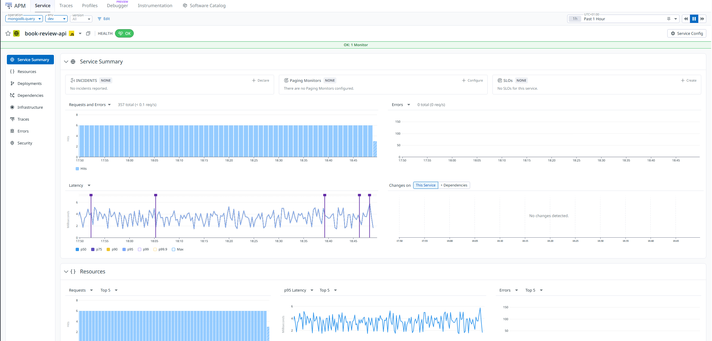
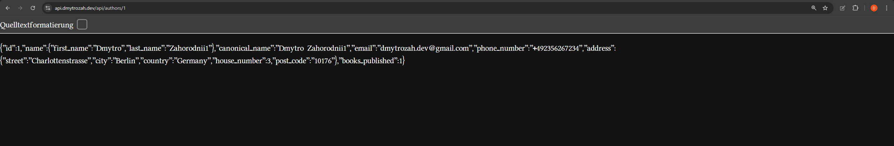
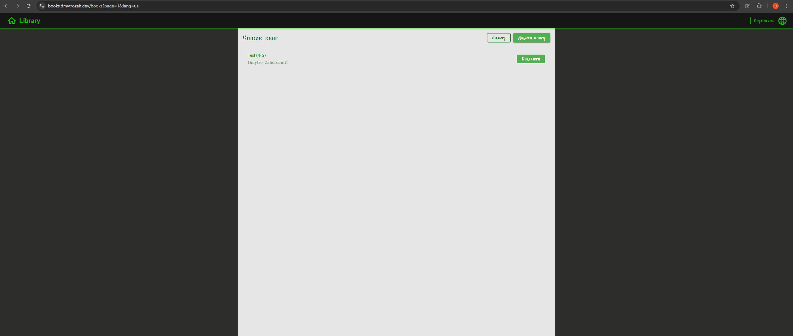
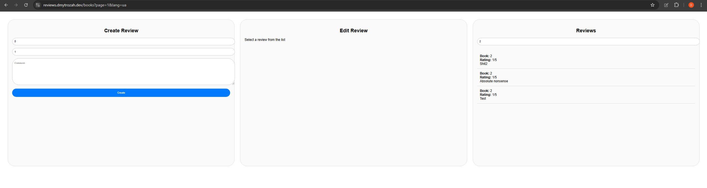

# PS_Task_6

<p>This project represents a secure, cloud-native microservices architecture developed during the Winter 2025 internship at ProfItSoft. Building upon <a href="https://github.com/dmytrozahor/PS_Task_5">PS_Task_5</a>, this implementation adds enterprise-grade security with Google OAuth2 authentication and full deployment to Google Kubernetes Engine (GKE).</p>

## Objective

Implementation of a production-ready microservices ecosystem with centralized authentication, authorization, and automated CI/CD deployment to Google Cloud Platform. The system demonstrates OAuth2 integration, Identity-Aware Proxy (IAP), Kubernetes orchestration, and continuous deployment practices.






## Live Deployment

- **Books UI**: https://books.dmytrozah.dev
- **Reviews UI**: https://reviews.dmytrozah.dev
- **API Gateway**: https://api.dmytrozah.dev

*Authentication: Login with any Google account to access the applications*

## System Architecture

The application comprises multiple microservices deployed on GKE with centralized gateway routing and OAuth2 security:

- **Gateway Service** - Spring Cloud Gateway with health checks, IAP integration, and routing to all microservices
- **Service-Authors** - Multi-module business logic with PostgreSQL persistence and RabbitMQ event publishing
- **Service-Email** - Asynchronous email notifications with Elasticsearch tracking and scheduled retry mechanism
- **Service-Books** - Frontend application for book management (Node.js/React)
- **Service-Reviews** - Book review API with MongoDB persistence and Datadog monitoring
- **Service-Reviews-UI** - Frontend for book reviews

### Security Implementation

#### Google OAuth2 Authentication
- **Identity-Aware Proxy (IAP)** configured at the load balancer level
- All incoming requests require Google authentication
- OAuth2 client credentials managed as Kubernetes secrets
- Session management handled by Google Cloud IAP

#### Authorization Flow
1. User accesses application through HTTPS load balancer
2. IAP intercepts unauthenticated requests and redirects to Google OAuth2
3. After successful authentication, IAP injects user identity headers
4. Gateway validates IAP headers and routes to backend services
5. `/profile` endpoint returns authenticated user information from JWT

#### Network Security
- **Managed SSL/TLS certificates** for all domains via Google Certificate Manager
- **HTTPS enforcement** on all external endpoints
- **Internal ClusterIP services** for service-to-service communication
- **Health check probes** for readiness and liveness monitoring

### Technical Stack

**Backend**
- `Java 21`, `Spring Boot 3.x`, `Spring Cloud Gateway`, `Spring Security OAuth2`
- `Node.js 18+`, `Express.js`
- `Lombok`, `MapStruct`, `Resilience4j`

**Infrastructure**
- `Google Kubernetes Engine (GKE)`, `Google Cloud Load Balancing`, `Identity-Aware Proxy (IAP)`
- `Google Artifact Registry`, `Google Cloud Build`
- `RabbitMQ` (message broker), `PostgreSQL 15`, `MongoDB`, `Elasticsearch`
- `Mailpit` (SMTP), `Kibana` (visualization), `Datadog` (APM monitoring)

**DevOps**
- `Docker`, `Kubernetes`, `GitHub Actions`
- `kubectl`, `Liquibase` (migrations)
- Automated CI/CD with Google Cloud Build triggers

**Frontend**
- `React`, `Nginx`, `TypeScript/JavaScript`

## Kubernetes Architecture

### Ingress Configuration

The project uses three separate ingress controllers with managed SSL certificates:

1. **API Gateway Ingress** (`api.dmytrozah.dev`)
    - Routes all API traffic through Gateway service
    - IAP-protected with OAuth2 client credentials
    - Static IP: `gateway-ip`

2. **Books UI Ingress** (`books.dmytrozah.dev`)
    - Serves React frontend at root path
    - Routes `/api/*` and `/profile` through Gateway
    - Static IP: `books-ui-ip`

3. **Reviews UI Ingress** (`reviews.dmytrozah.dev`)
    - Serves Reviews frontend at root path
    - Routes `/api/*` and `/profile` through Gateway
    - Static IP: `reviews-ui-ip`

### Health Monitoring

All services implement health check endpoints:
- **Gateway**: `GET /health` (port 1000)
- **Authors**: `GET /health` (port 1002)
- **Email**: `GET /health` (port 1001)
- **Books UI**: `GET /` (port 3050)
- **Reviews API**: TCP check (port 3000)
- **Reviews UI**: `GET /` (port 80)

## Building and Deployment

### Prerequisites

- `Java >= 21`, `Gradle >= 8.x`, `Node.js >= 18.x`
- `Docker` & `Docker Compose`
- `kubectl`, `gcloud CLI`
- Google Cloud Platform account with GKE enabled
- GitHub account with Actions enabled

### Step 1: Configure Google Cloud

```bash
# Set project
gcloud config set project ps-task-6

# Create GKE cluster
gcloud container clusters create ps-task-cluster \
    --zone=europe-west1 \
    --num-nodes=3 \
    --machine-type=e2-medium \
    --enable-autoscaling \
    --min-nodes=2 \
    --max-nodes=5

# Get credentials
gcloud container clusters get-credentials ps-task-cluster --zone=europe-west1
```

### Step 2: Set Up OAuth2 Credentials

1. Go to [Google Cloud Console](https://console.cloud.google.com/apis/credentials)
2. Create OAuth 2.0 Client ID
3. Configure authorized redirect URIs
4. Update `06-iap-secret.yaml` with your credentials


### Step 3: Reserve Static IPs

```bash
gcloud compute addresses create gateway-ip --global
gcloud compute addresses create books-ui-ip --global
gcloud compute addresses create reviews-ui-ip --global
```

### Step 4: Deploy to Kubernetes

```bash
# Create namespace
kubectl create namespace ps-task

# Apply configurations in order
kubectl apply -f k8s/40-postgres-secret.yaml
kubectl apply -f k8s/06-iap-secret.yaml
kubectl apply -f k8s/05-backendconfig.yaml
kubectl apply -f k8s/06-managed-cert.yaml
kubectl apply -f k8s/60-ui-managed-cert.yaml
kubectl apply -f k8s/70-reviews-managed-cert.yaml

# Deploy services
kubectl apply -f k8s/10-gateway.yaml
kubectl apply -f k8s/20-service-email.yaml
kubectl apply -f k8s/30-service-authors.yaml
kubectl apply -f k8s/60-service-books-deployment.yaml
kubectl apply -f k8s/60-service-books.yaml
kubectl apply -f k8s/70-service-reviews.yaml
kubectl apply -f k8s/70-reviews-ui.yaml

# Deploy ingress
kubectl apply -f k8s/50-gateway-ingress.yaml
kubectl apply -f k8s/60-service-books-ingress.yaml
kubectl apply -f k8s/70-reviews-ui-ingress.yaml
```

### Step 5: Verify Deployment

```bash
# Check pods
kubectl get pods -n ps-task

# Check services
kubectl get svc -n ps-task

# Check ingress
kubectl get ingress -n ps-task

# View logs
kubectl logs -f deployment/gateway -n ps-task
```

### Step 6: Configure DNS

Point your domains to the reserved static IPs:
```
api.dmytrozah.dev     → gateway-ip
books.dmytrozah.dev   → books-ui-ip
reviews.dmytrozah.dev → reviews-ui-ip
```

SSL certificates will be automatically provisioned by Google Certificate Manager.

## Local Development

### Build Services

```bash
# Gateway
cd gateway && ./gradlew clean bootJar && cd ..

# Service Authors
cd service-authors && ./gradlew clean bootJar && cd ..

# Service Email
cd service-email && ./gradlew clean bootJar && cd ..

# Service Books (Node.js)
cd service-books && npm install && npm run build && cd ..

# Service Reviews
cd service-book-reviews && npm install && npm run build && cd ..
```

### Run with Docker Compose

```bash
# Start infrastructure
docker-compose -f docker-compose-infra.yml up -d

# Start services
docker-compose up -d
```

## Access Points (Cloud)

| Service                       | URL                                    |
|-------------------------------|----------------------------------------|
| Gateway                       | https://:1000                          |
| Service Books (`UI`)          | https://books.dmytrozah.dev/           |
| Service Reviews (`UI`)        | https://reviews.dmytrozah.dev/         |
| Service Authors (`API`)       | https://api.dmytrozah.dev/api/authors/ |
| Service Email (`API`)         | https://api.dmytrozah.dev/api/emails/  |
| Service Books (`API`)         | https://api.dmytrozah.dev/api/books/   |
| Service Reviews (`API`)       | https://api.dmytrozah.dev/api/reviews/ |
| RabbitMQ Management (`INFRA`) | 0.0.0.0:15672                          |
| Kibana Dashboard (`INFRA`)    | 0.0.0.0:5601                           |
| Mailpit UI (`INFRA`)          | 0.0.0.0:8025                           |
| PostgreSQL (`INFRA`)          | 0.0.0.0:5432                           |
| MongoDB (`INFRA`)             | 0.0.0.0:27017                          |

## API Endpoints

### Authentication

```http
GET /profile
Authorization: Bearer <jwt-token>

Response:
{
  "email": "user@example.com",
  "name": "John Doe"
}
```

### Gateway Routes

- `GET /health` - Gateway health check
- `GET /profile` - User profile information
- `POST /api/authors` - Create author (proxied to service-authors)
- `GET /api/authors` - List authors (proxied to service-authors)
- `GET /api/emails` - Email history (proxied to service-email)
- `GET /api/books/*` - Book operations (proxied to service-books)
- `GET /api/reviews/*` - Review operations (proxied to service-reviews)

---

**Project Contact**: Dmytro Zahor | Winter 2025 ProfItSoft Internship